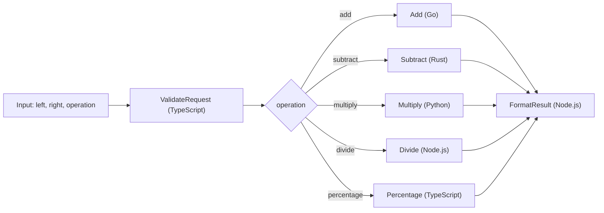

# POC Step Functions Calculator

This repository contains a calculator workflow built with AWS Step Functions, Terraform, and Lambda functions implemented in multiple runtimes. The state machine receives two numbers and an operation, validates the request, routes execution to the correct Lambda, and returns a normalized final response.

The repository is intended to be almost ready for AWS deployment. In practice, the main remaining setup step is adding AWS credentials to GitHub Actions secrets.

## Architecture



## Workflow

1. `ValidateRequest` receives `left`, `right`, and either `operation` or `action`.
2. The validation Lambda ensures both values are numeric and normalizes aliases such as `+`, `sum`, `-`, `*`, `/`, and `%`.
3. `RouteOperation` in Step Functions selects the correct operation Lambda.
4. The selected Lambda computes the result in its own runtime.
5. `FormatResult` produces a consistent response for logs, APIs, or tests.

Sample input:

```json
{
  "left": 120,
  "right": 15,
  "operation": "percentage"
}
```

Sample output:

```json
{
  "left": 120,
  "right": 15,
  "operation": "percentage",
  "requestedAt": "2026-03-14T18:00:00.000Z",
  "result": 18,
  "handledBy": "typescript-percentage",
  "summary": "120 * 15% = 18",
  "completedAt": "2026-03-14T18:00:01.000Z"
}
```

## Supported operations

- `add`
- `subtract`
- `multiply`
- `divide`
- `percentage`

The validator also accepts aliases such as `+`, `-`, `*`, `/`, `%`, `sum`, and `percent`.

## Lambda inventory

- `01_validate_request_ts`
  Runtime: TypeScript compiled to Node.js 22
  Responsibility: validate input, normalize the operation, and block obvious request errors before routing.
- `02_add_go`
  Runtime: Go on `provided.al2023`
  Responsibility: add two numbers.
- `03_subtract_rust`
  Runtime: Rust on `provided.al2023`
  Responsibility: subtract two numbers.
- `04_multiply_python`
  Runtime: Python 3.12
  Responsibility: multiply two numbers.
- `05_divide_node`
  Runtime: Node.js 22
  Responsibility: divide two numbers and protect against division by zero.
- `06_percentage_ts`
  Runtime: TypeScript compiled to Node.js 22
  Responsibility: compute `left * right / 100`.
- `07_format_result_node`
  Runtime: Node.js 22
  Responsibility: build the final response with a human-readable summary and completion timestamp.

Each Lambda folder also includes its own `README.md` with runtime-specific details.

## Repository structure

```text
.
|-- .github/workflows/manual-terraform-calculator.yml
|-- lambdas/
|   |-- 01_validate_request_ts/
|   |-- 02_add_go/
|   |-- 03_subtract_rust/
|   |-- 04_multiply_python/
|   |-- 05_divide_node/
|   |-- 06_percentage_ts/
|   `-- 07_format_result_node/
|-- scripts/build_lambdas.sh
|-- terraform/
|-- package.json
`-- README.md
```

## Why Step Functions

Step Functions is not an alternative to a state machine. It is the managed AWS service used to implement one.

This solution is a good fit for Step Functions because it:

- keeps orchestration separate from Lambda business logic
- makes routing and execution flow visible in the AWS console
- allows retries, catches, waits, parallel branches, or maps to be added without rewriting the whole solution
- supports mixing multiple runtimes in the same workflow
- improves observability across the entire execution

## Why this repository does not use Serverless Framework

Serverless Framework was intentionally not added because Terraform already covers the infrastructure responsibilities needed here:

- IAM
- Lambda
- CloudWatch Logs
- Step Functions
- artifact packaging
- environment variables and deployment parameters

Adding another infrastructure layer on top of Terraform would duplicate responsibilities and add operational complexity without a clear benefit for this example.

## Terraform status

The [terraform](/Users/cristobalcontreras/GitHub/poc-step-function/terraform) directory is already structured for a realistic deployment:

- updated providers and refreshed `.terraform.lock.hcl`
- `terraform_data` to trigger local artifact builds
- `archive_file` packaging from `build/lambdas/`
- scoped IAM so Step Functions can invoke only the project Lambdas
- CloudWatch log groups for Lambdas and the state machine
- state machine definition written in HCL with `jsonencode`
- outputs for resource discovery and a sample execution payload

Main variables:

- `aws_region`
- `project_name`
- `environment`
- `lambda_timeout`
- `lambda_memory_size`
- `log_retention_days`

## Local build

Install Node.js tooling for the repository:

```bash
npm ci
```

Build Lambda artifacts:

```bash
./scripts/build_lambdas.sh
```

The script writes deployable Lambda artifacts to `build/lambdas/`.

### Local requirements

- Node.js 22
- npm
- Go 1.25
- Python 3.12
- Terraform 1.5 or newer
- stable Rust with `rustup` and the `x86_64-unknown-linux-musl` target, or Docker as a fallback for the Rust build

### TypeScript note

The TypeScript Lambdas use `module` and `moduleResolution` set to `NodeNext` so the project stays aligned with modern TypeScript behavior and avoids the deprecated `node10` resolution path.

## Useful validation commands

```bash
npm ci
./scripts/build_lambdas.sh
terraform -chdir=terraform init -upgrade
terraform -chdir=terraform fmt -recursive
terraform -chdir=terraform validate
```

## Manual Terraform deployment

```bash
cd terraform
terraform init -upgrade
terraform fmt -recursive
terraform plan \
  -var="aws_region=us-east-1" \
  -var="environment=dev"
terraform apply
```

## GitHub Actions

The workflow [manual-terraform-calculator.yml](/Users/cristobalcontreras/GitHub/poc-step-function/.github/workflows/manual-terraform-calculator.yml) includes:

- manual trigger with `workflow_dispatch`
- branch-based concurrency control
- Node.js, Go, Python, Rust, and Terraform setup
- build steps for all Lambdas
- `terraform fmt`
- `terraform init`
- `terraform validate`
- `terraform plan`
- optional `terraform apply` when `terraform_action` is set to `apply`

### Required secrets

To make the workflow AWS-ready, configure these GitHub secrets:

- `AWS_ACCESS_KEY_ID`
- `AWS_SECRET_ACCESS_KEY`
- `AWS_SESSION_TOKEN` if you use temporary credentials

Once those values are configured, the repository can be deployed through the manual workflow without changing the main infrastructure definition.
