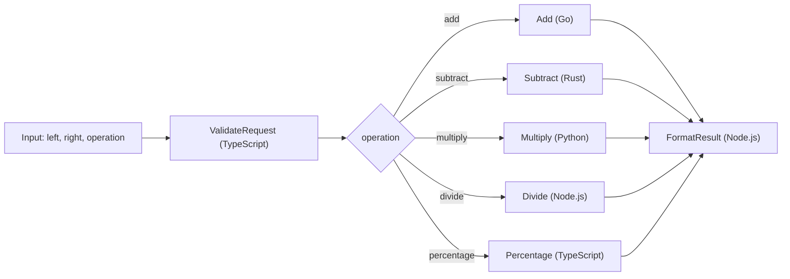

# POC Step Functions Calculator

Este repositorio despliega una calculadora orquestada con AWS Step Functions y Terraform. La state machine recibe dos numeros y una operacion, valida el request, enruta la ejecucion hacia la Lambda correcta segun la accion pedida y devuelve una respuesta final lista para consumir.

## Arquitectura



## Flujo funcional

1. `ValidateRequest` recibe `left`, `right` y `operation` o `action`.
2. La Lambda normaliza aliases como `+`, `sum`, `-`, `*`, `/` y `%`.
3. `RouteOperation` en la Step Function decide que Lambda ejecutar.
4. La Lambda de operacion calcula el resultado en su runtime.
5. `FormatResult` construye una salida consistente y legible.

Payload de entrada esperado:

```json
{
  "left": 120,
  "right": 15,
  "operation": "percentage"
}
```

Payload de salida de ejemplo:

```json
{
  "left": 120,
  "right": 15,
  "operation": "percentage",
  "requestedAt": "2026-03-14T18:00:00.000Z",
  "result": 18,
  "handledBy": "typescript-percentage",
  "summary": "120 * 15% = 18",
  "completedAt": "2026-03-14T18:00:01.000Z"
}
```

## Lambdas incluidas

- `01_validate_request_ts`: valida numeros, normaliza la operacion y corta errores comunes antes del routing.
- `02_add_go`: suma dos numeros usando Go con runtime custom `provided.al2023`.
- `03_subtract_rust`: resta dos numeros usando Rust con runtime custom `provided.al2023`.
- `04_multiply_python`: multiplica dos numeros usando Python.
- `05_divide_node`: divide dos numeros usando Node.js y protege contra division por cero.
- `06_percentage_ts`: calcula `left * right / 100` usando TypeScript.
- `07_format_result_node`: devuelve la salida final con un `summary` listo para logs o APIs.

## Por que usar Step Functions

Aclaracion importante: Step Functions es justamente el servicio administrado de AWS para modelar una maquina de estado. No es una alternativa a la maquina de estado, sino la forma de implementarla sin tener que codificar la orquestacion dentro de una sola Lambda.

En esta solucion conviene usar Step Functions porque:

- Separa la orquestacion del calculo de cada Lambda.
- Hace visible el routing por operacion desde la consola de AWS.
- Permite agregar `Retry`, `Catch`, `Parallel`, `Map` o nuevos pasos sin reescribir todas las Lambdas.
- Facilita mezclar runtimes distintos dentro del mismo flujo.
- Centraliza observabilidad y logs del proceso completo.

## Por que no agregar Serverless Framework

No agregue Serverless Framework porque Terraform ya cubre en este repo:

- Definicion de IAM, Lambda, CloudWatch y Step Functions.
- Empaquetado y despliegue de artefactos.
- Parametrizacion por variables y entornos.

Meter Serverless encima de Terraform agregaria otra capa de IaC para los mismos recursos y aumentaria la complejidad operativa sin una ganancia clara para este caso.

## Terraform actualizado

La capa de Terraform quedo preparada para un despliegue casi directo a AWS:

- Providers actualizados y lockfile renovado.
- `terraform_data` para construir artefactos antes de empaquetarlos.
- `archive_file` para zippear cada Lambda desde `build/lambdas/`.
- IAM de menor privilegio para que Step Functions invoque solo las Lambdas del proyecto.
- CloudWatch Log Groups para las Lambdas y para la state machine.
- State machine definida con `jsonencode`, `Choice` por operacion y `Retry` comun para invocaciones Lambda.

Variables principales:

- `aws_region`: region AWS del despliegue.
- `project_name`: prefijo de recursos.
- `environment`: sufijo del entorno, por ejemplo `dev`.
- `lambda_timeout`: timeout compartido por las Lambdas.
- `lambda_memory_size`: memoria compartida por las Lambdas.
- `log_retention_days`: dias de retencion de logs.

## Build local

El repo genera artefactos listos para Lambda en `build/lambdas/`:

```bash
npm ci
./scripts/build_lambdas.sh
```

Requisitos locales:

- Node.js 22
- Go 1.25
- Python 3.12
- Docker, para compilar la Lambda en Rust a Linux
- Terraform 1.5 o superior

## Despliegue manual con Terraform

```bash
cd terraform
terraform init -upgrade
terraform fmt -recursive
terraform plan \
  -var="aws_region=us-east-1" \
  -var="environment=dev"
terraform apply
```

## GitHub Actions

Se agrego el workflow manual `.github/workflows/manual-terraform-calculator.yml` con:

- `workflow_dispatch`
- bloqueo de concurrencia por rama
- build de todas las Lambdas
- `terraform fmt`, `init`, `validate` y `plan`
- `apply` opcional si el input `terraform_action` viene en `apply`

Para dejarlo listo para AWS solo falta configurar estos secrets en GitHub:

- `AWS_ACCESS_KEY_ID`
- `AWS_SECRET_ACCESS_KEY`
- `AWS_SESSION_TOKEN` opcional, solo si usas credenciales temporales

Con eso ya puedes ejecutar el workflow manual y desplegar el stack.
