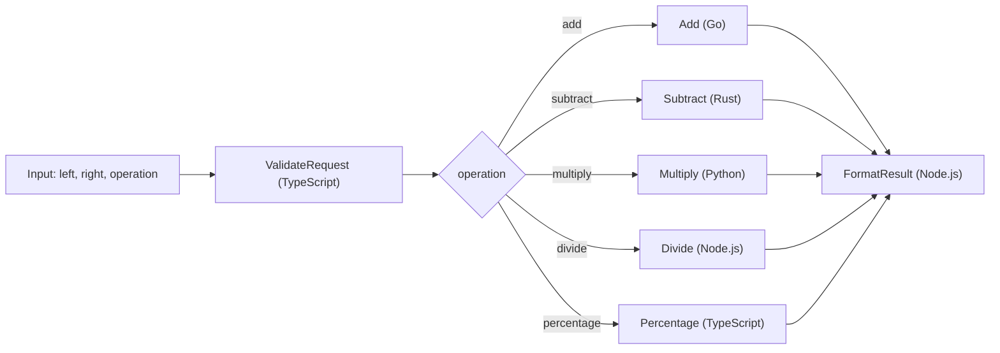

# POC Step Functions Calculator

Este repositorio implementa una calculadora orquestada con AWS Step Functions, Terraform y Lambdas en varios runtimes. La state machine recibe dos numeros y una operacion, valida el request, enruta la ejecucion hacia la Lambda correcta y devuelve una respuesta final uniforme.

La idea del proyecto es dejar un ejemplo casi listo para desplegar en AWS. En la practica, lo unico que falta para correr el workflow de GitHub Actions es configurar los secrets de credenciales.

## Arquitectura



## Flujo

1. `ValidateRequest` recibe `left`, `right` y `operation` o `action`.
2. La Lambda valida que ambos valores sean numericos y normaliza aliases como `+`, `sum`, `-`, `*`, `/` y `%`.
3. `RouteOperation` en Step Functions decide que Lambda ejecutar.
4. La Lambda de operacion calcula el resultado en su runtime.
5. `FormatResult` arma una salida final consistente para logs, APIs o pruebas.

Input de ejemplo:

```json
{
  "left": 120,
  "right": 15,
  "operation": "percentage"
}
```

Output de ejemplo:

```json
{
  "left": 120,
  "right": 15,
  "operation": "percentage",
  "requestedAt": "2026-03-14T18:00:00.000Z",
  "result": 18,
  "handledBy": "typescript-percentage",
  "summary": "120 * 15% = 18",
  "completedAt": "2026-03-14T18:00:01.000Z"
}
```

## Operaciones soportadas

- `add`
- `subtract`
- `multiply`
- `divide`
- `percentage`

Tambien se aceptan aliases como `+`, `-`, `*`, `/`, `%`, `sum` y `percent`.

## Lambdas del proyecto

- `01_validate_request_ts`
  Runtime: TypeScript compilado a Node.js 22
  Responsabilidad: validar input, normalizar la operacion y bloquear errores obvios antes del routing.
- `02_add_go`
  Runtime: Go con `provided.al2023`
  Responsabilidad: sumar dos numeros.
- `03_subtract_rust`
  Runtime: Rust con `provided.al2023`
  Responsabilidad: restar dos numeros.
- `04_multiply_python`
  Runtime: Python 3.12
  Responsabilidad: multiplicar dos numeros.
- `05_divide_node`
  Runtime: Node.js 22
  Responsabilidad: dividir dos numeros y proteger contra division por cero.
- `06_percentage_ts`
  Runtime: TypeScript compilado a Node.js 22
  Responsabilidad: calcular `left * right / 100`.
- `07_format_result_node`
  Runtime: Node.js 22
  Responsabilidad: construir la respuesta final con `summary` y timestamps.

## Estructura del repo

```text
.
|-- .github/workflows/manual-terraform-calculator.yml
|-- lambdas/
|   |-- 01_validate_request_ts/
|   |-- 02_add_go/
|   |-- 03_subtract_rust/
|   |-- 04_multiply_python/
|   |-- 05_divide_node/
|   |-- 06_percentage_ts/
|   `-- 07_format_result_node/
|-- scripts/build_lambdas.sh
|-- terraform/
|-- package.json
`-- README.md
```

## Por que usar Step Functions

Paso importante: Step Functions no reemplaza una maquina de estado, sino que es el servicio administrado de AWS para implementarla.

En este caso conviene porque:

- separa claramente la orquestacion de la logica de negocio de cada Lambda
- hace visible el flujo y el routing por operacion desde la consola de AWS
- permite agregar `Retry`, `Catch`, `Wait`, `Parallel` o `Map` sin reescribir toda la solucion
- permite combinar runtimes distintos en el mismo proceso
- mejora observabilidad y trazabilidad de la ejecucion completa

## Por que no usar Serverless Framework aqui

No agregue Serverless Framework porque Terraform ya cubre toda la capa de infraestructura que necesita este proyecto:

- IAM
- Lambda
- CloudWatch Logs
- Step Functions
- empaquetado de artefactos
- variables por entorno

Agregar otra capa de IaC sobre Terraform aumentaria complejidad y duplicaria responsabilidades.

## Estado actual de Terraform

La carpeta [terraform](/Users/cristobalcontreras/GitHub/poc-step-function/terraform) ya quedo orientada a despliegue real:

- providers actualizados y `.terraform.lock.hcl` renovado
- `terraform_data` para disparar el build local de artefactos
- `archive_file` para zippear cada Lambda desde `build/lambdas/`
- IAM de menor privilegio para que Step Functions invoque solo las Lambdas del proyecto
- CloudWatch Log Groups para Lambdas y state machine
- definicion de la state machine en HCL via `jsonencode`
- outputs utiles para identificar recursos y payload de ejemplo

Variables principales:

- `aws_region`
- `project_name`
- `environment`
- `lambda_timeout`
- `lambda_memory_size`
- `log_retention_days`

## Build local

Instalacion de tooling Node del repo:

```bash
npm ci
```

Build de artefactos:

```bash
./scripts/build_lambdas.sh
```

El script genera los paquetes listos para Terraform en `build/lambdas/`.

### Requisitos locales

- Node.js 22
- npm
- Go 1.25
- Python 3.12
- Terraform 1.5 o superior
- Rust estable con `rustup` y target `x86_64-unknown-linux-musl`, o Docker disponible como fallback para compilar la Lambda en Rust

Nota sobre TypeScript:

- las Lambdas TypeScript usan `module` y `moduleResolution` en `NodeNext` para evitar la resolucion `node10` deprecada y quedar alineadas con versiones nuevas de TypeScript

## Verificaciones utiles

```bash
npm ci
./scripts/build_lambdas.sh
terraform -chdir=terraform init -upgrade
terraform -chdir=terraform fmt -recursive
terraform -chdir=terraform validate
```

## Despliegue manual con Terraform

```bash
cd terraform
terraform init -upgrade
terraform fmt -recursive
terraform plan \
  -var="aws_region=us-east-1" \
  -var="environment=dev"
terraform apply
```

## GitHub Actions

El workflow [manual-terraform-calculator.yml](/Users/cristobalcontreras/GitHub/poc-step-function/.github/workflows/manual-terraform-calculator.yml) incluye:

- trigger manual con `workflow_dispatch`
- concurrencia por rama
- instalacion de Node.js, Go, Python, Rust y Terraform
- build de todas las Lambdas
- `terraform fmt`
- `terraform init`
- `terraform validate`
- `terraform plan`
- `terraform apply` opcional cuando el input `terraform_action` es `apply`

### Secrets requeridos

Para dejarlo listo para AWS solo falta configurar estos secrets en GitHub:

- `AWS_ACCESS_KEY_ID`
- `AWS_SECRET_ACCESS_KEY`
- `AWS_SESSION_TOKEN` opcional si usas credenciales temporales

Con eso ya puedes ejecutar el workflow manual y desplegar el stack sin tocar la definicion principal del repo.
